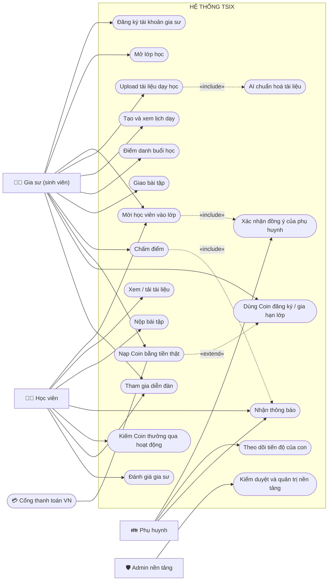
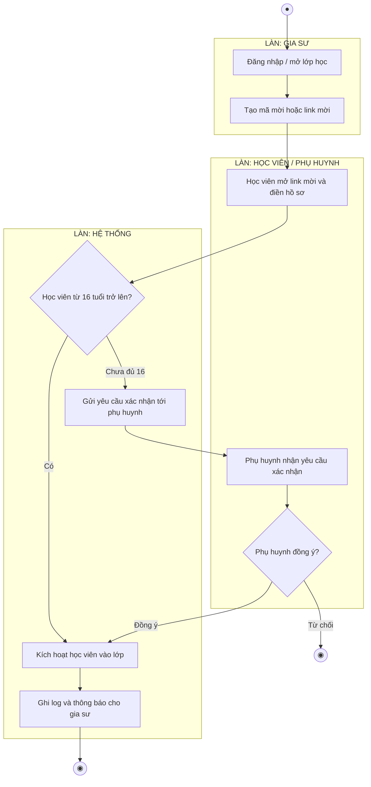
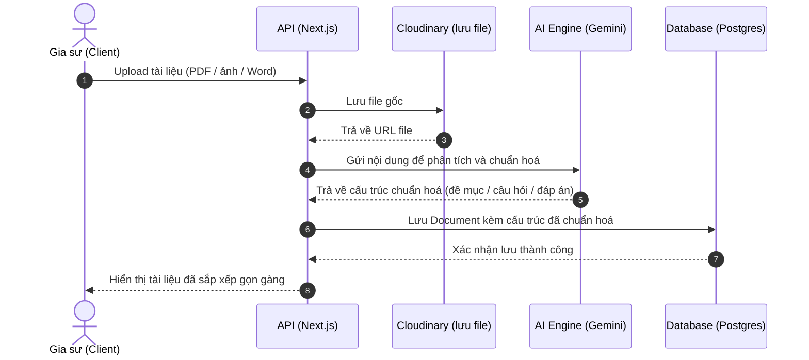
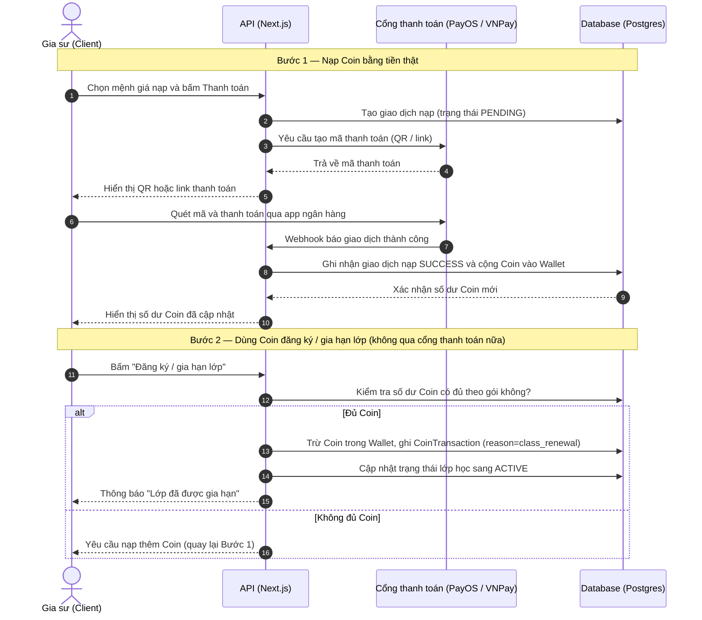

# Biểu đồ hành vi (Use Case · Activity · Sequence)

> Nguồn: artifact "Sơ Đồ Hành Vi Tsix". GitHub render mermaid trực tiếp trong file .md này.

## 1. Use Case — tổng quan hệ thống

5 tác nhân (Gia sư, Học viên, Phụ huynh, Admin nền tảng, Cổng thanh toán) và 20 use case chính. Hai quan hệ `<<include>>` mã hoá đúng quy tắc nghiệp vụ: mời học viên dưới 16 tuổi luôn kéo theo xin phép phụ huynh, và upload tài liệu luôn đi qua AI chuẩn hoá. Quan hệ `<<extend>>` thể hiện: nạp Coin có thể dẫn tới dùng Coin đăng ký lớp.

## 2. Activity — Mời học viên vào lớp (nhánh consent phụ huynh)

Luồng chứa nhánh rẽ pháp lý quan trọng nhất: kiểm tra tuổi học viên, dưới 16 bắt buộc rẽ sang xin phép phụ huynh (Nghị định 13/2023/NĐ-CP + Luật Trẻ em 2016) trước khi kích hoạt Enrollment.

## 3a. Sequence — Upload tài liệu và AI tự chuẩn hoá

## 3b. Sequence — Nạp Coin bằng tiền thật và dùng Coin đăng ký / gia hạn lớp

Coin ở đây là số dư trả trước cho dịch vụ của chính Tsix (gia sư tự nạp, tự tiêu) — không phải ví trung gian giữ tiền giữa hai người dùng, nên không vướng quy định về trung gian thanh toán của Ngân hàng Nhà nước.

