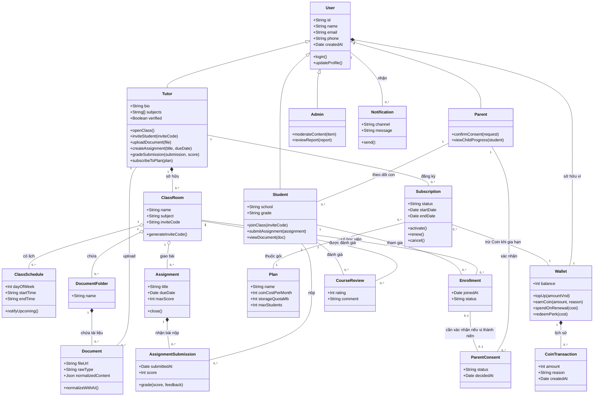

# Biểu đồ cấu trúc tĩnh (Class Diagram · ERD)

> Nguồn: artifact "Sơ Đồ Cấu Trúc Tsix".

## 1. Class Diagram — mức khái niệm (logical view)

`User` là lớp cha, kế thừa xuống `Tutor / Student / Parent / Admin` để thể hiện đúng hành vi khác nhau của từng vai trò — điều mà cột `role` đơn lẻ trong DB không lột tả được.

## 2. ERD — mức vật lý (khớp Prisma/Postgres sau migration đa-gia-sư)

So với schema hiện tại: đổi `Course.adminId` (1-1) thành `Course.tutorId` (N-1); gộp `ExamFileFolder/ExamFile` thành `DOCUMENT_FOLDER/DOCUMENT` tổng quát; thêm 5 bảng mới `PARENT_LINK`, `PARENT_CONSENT`, `PLAN`, `SUBSCRIPTION`, `PAYMENT_TRANSACTION`. Luồng tiền đi một chiều: `USER → PAYMENT_TRANSACTION → COIN_TRANSACTION(+) → WALLET`, sau đó `SUBSCRIPTION` chỉ *trừ* từ số dư `WALLET` khi gia hạn.

```mermaid
erDiagram
  USER ||--o{ COURSE : "so huu (tutorId)"
  USER ||--o{ ENROLLMENT : "tham gia (userId)"
  COURSE ||--o{ ENROLLMENT : "co hoc vien"
  COURSE ||--o{ CLASS_SCHEDULE : "co lich"
  COURSE ||--o{ DOCUMENT_FOLDER : "chua thu muc"
  DOCUMENT_FOLDER ||--o{ DOCUMENT : "chua tai lieu"
  USER ||--o{ DOCUMENT : "upload (uploaderId)"
  COURSE ||--o{ ASSIGNMENT : "giao bai"
  ASSIGNMENT ||--o{ ASSIGNMENT_SUBMISSION : "nhan bai nop"
  USER ||--o{ ASSIGNMENT_SUBMISSION : "nop bai (studentId)"
  USER ||--o{ PARENT_LINK : "la phu huynh (parentUserId)"
  USER ||--o{ PARENT_LINK : "duoc lien ket (studentUserId)"
  USER ||--o{ PARENT_CONSENT : "xac nhan (parentUserId)"
  ENROLLMENT ||--o| PARENT_CONSENT : "can xac nhan"
  USER ||--o{ SUBSCRIPTION : "dang ky (tutorId)"
  PLAN ||--o{ SUBSCRIPTION : "thuoc goi"
  USER ||--o{ PAYMENT_TRANSACTION : "nap coin (userId)"
  USER ||--|| WALLET : "so huu vi"
  WALLET ||--o{ COIN_TRANSACTION : "lich su coin"
  USER ||--o{ NOTIFICATION : "nhan thong bao"
  COURSE ||--o{ THREAD : "co dien dan"
  USER ||--o{ THREAD : "dang bai (authorId)"
  THREAD ||--o{ THREAD_REPLY : "co tra loi"
  USER ||--o{ THREAD_REPLY : "tra loi (authorId)"
  COURSE ||--o{ COURSE_REVIEW : "duoc danh gia"
  USER ||--o{ COURSE_REVIEW : "danh gia (studentId)"

  USER {
    string id PK
    string name
    string email UK
    string role "student | tutor | parent | admin"
    string phone
    datetime createdAt
  }
  COURSE {
    string id PK
    string tutorId FK
    string name
    string subject
    string inviteCode UK
    datetime createdAt
  }
  CLASS_SCHEDULE {
    string id PK
    string courseId FK
    int dayOfWeek
    string startTime
    string endTime
  }
  ENROLLMENT {
    string id PK
    string userId FK
    string courseId FK
    string status
    datetime joinedAt
  }
  PARENT_LINK {
    string id PK
    string parentUserId FK
    string studentUserId FK
    string relation
  }
  PARENT_CONSENT {
    string id PK
    string enrollmentId FK
    string parentUserId FK
    string status
    datetime decidedAt
  }
  DOCUMENT_FOLDER {
    string id PK
    string courseId FK
    string name
  }
  DOCUMENT {
    string id PK
    string folderId FK
    string uploaderId FK
    string fileUrl
    string rawType
    json normalizedContent
    datetime createdAt
  }
  ASSIGNMENT {
    string id PK
    string courseId FK
    string title
    datetime dueDate
    int maxScore
  }
  ASSIGNMENT_SUBMISSION {
    string id PK
    string assignmentId FK
    string studentId FK
    datetime submittedAt
    int score
  }
  PLAN {
    string id PK
    string name
    int coinCostPerMonth
    int storageQuotaMb
    int maxStudents
  }
  SUBSCRIPTION {
    string id PK
    string tutorId FK
    string planId FK
    string status
    datetime startDate
    datetime endDate
  }
  PAYMENT_TRANSACTION {
    string id PK
    string userId FK
    int amountVnd
    string gateway
    string status "PENDING | SUCCESS | FAILED"
    datetime paidAt
  }
  WALLET {
    string userId PK
    int balance
  }
  COIN_TRANSACTION {
    string id PK
    string userId FK
    int amount
    string reason "topup | class_renewal | activity_reward"
    string refId "PAYMENT_TRANSACTION.id hoac SUBSCRIPTION.id"
    datetime createdAt
  }
  NOTIFICATION {
    string id PK
    string userId FK
    string channel
    string message
    datetime sentAt
  }
  THREAD {
    string id PK
    string courseId FK
    string authorId FK
    string title
  }
  THREAD_REPLY {
    string id PK
    string threadId FK
    string authorId FK
  }
  COURSE_REVIEW {
    string id PK
    string courseId FK
    string studentId FK
    int rating
  }
```

