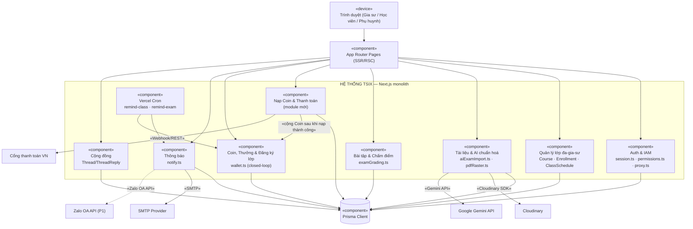
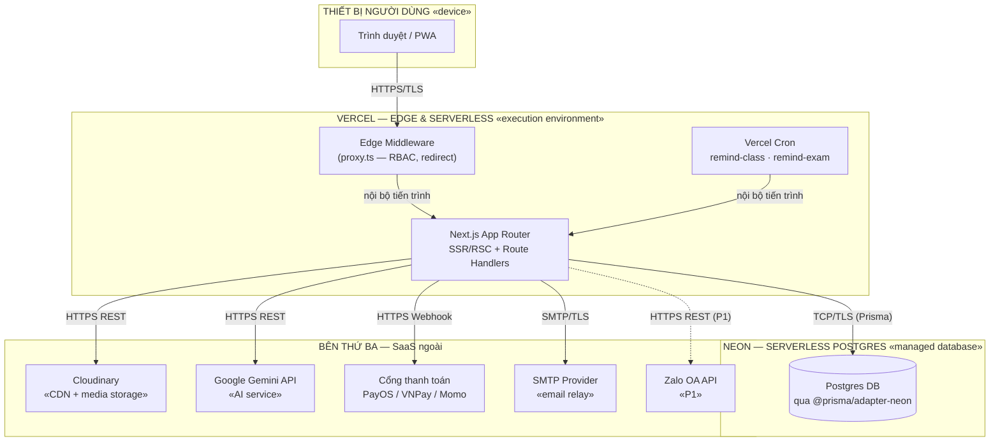

# Biểu đồ kiến trúc & triển khai (Component · Deployment)

> Nguồn: artifact "Sơ Đồ Triển Khai Tsix".

## 1. Component Diagram

Next.js monolith — không tách microservice. `Nạp Coin & Thanh toán` chỉ chạm cổng thanh toán ở bước nạp; `Coin, Thưởng & Đăng ký lớp` xử lý nội bộ toàn bộ phần dùng Coin.

## 2. Deployment Diagram

Chỉ 2 node do Tsix vận hành thật (Vercel serverless + Neon Postgres serverless); còn lại là SaaS bên thứ ba. Cố tình **không** dùng Kafka/Redis/MongoDB như tài liệu kiến trúc cũ trong `files/06_quan_tri_lop.md` — quy mô MVP sinh viên gia sư chưa cần.

