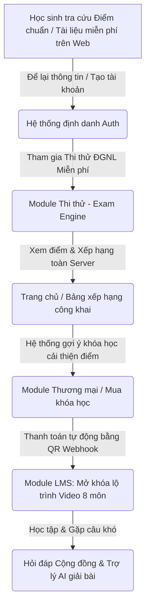

# TÀI LIỆU TỔNG QUAN DỰ ÁN: NỀN TẢNG GIÁO DỤC TRỰC TUYẾN TSIX EDUCATION

---

## I. THÔNG TIN CHUNG (PROJECT OVERVIEW)

| Hạng mục | Nội dung |
|---|---|
| **Tên dự án** | TSIX Education |
| **Mô hình kinh doanh** | B2C E-learning Platform (Nền tảng học trực tuyến thương mại dành cho học sinh) |
| **Đối tượng mục tiêu** | Học sinh THPT toàn quốc, trọng tâm **học sinh lớp 12** chuẩn bị thi Tốt nghiệp THPT và các kỳ thi riêng |
| **Tầm nhìn sản phẩm** | Hệ sinh thái học tập và luyện thi trực tuyến tinh gọn, chịu tải tốt, bảo mật tuyệt đối tài nguyên khóa học và tối ưu hóa phễu chuyển đổi thương mại tự động |

---

## II. ĐỊNH HƯỚNG NỘI DUNG & SẢN PHẨM PHÂN PHỐI

TSIX Education tập trung toàn bộ nguồn lực vào phân khúc luyện thi khốc liệt và có nhu cầu cao nhất:

### 1. Khóa học Lớp 12 & Ôn thi Tốt nghiệp THPT (8 Môn cốt lõi)

Hệ thống bài giảng video kèm tài liệu PDF và kho bài tập tự luyện chia nhỏ theo từng chuyên đề:

- **Khối Tự nhiên:** Toán học, Vật lý, Hóa học, Sinh học
- **Khối Xã hội:** Ngữ văn, Lịch sử, Địa lý
- **Ngoại ngữ:** Tiếng Anh

### 2. Khóa học Mũi nhọn: Ôn thi Đánh giá Năng lực (ĐGNL) & Đánh giá Tư duy

Sản phẩm mang lại doanh thu và nhận diện thương hiệu cao nhất, đón đầu xu hướng tuyển sinh hiện đại:

- **ĐGNL Đại học Quốc gia Hà Nội (HSA):** Tập trung tư duy định lượng (Toán), định tính (Văn/Ngôn ngữ) và phần Khoa học (Lý, Hóa, Sinh, Sử, Địa)
- **ĐGNL Đại học Quốc gia TP.HCM:** Năng lực ngôn ngữ, logic, phân tích số liệu và giải quyết vấn đề
- **Đại học Bách Khoa Hà Nội (TSA):** Tư duy Toán học, Tư duy Đọc hiểu và Tư duy Khoa học/Giải quyết vấn đề

---

## III. BỘ QUY TẮC PHÁT TRIỂN DỰ ÁN (PROJECT GUIDELINES)

Toàn bộ đội ngũ (Dev, Design, Content) phải tuân thủ nghiêm ngặt 5 bộ quy tắc sau:

### Quy tắc 1: Bảo mật và Chống tải lậu Tài nguyên

- **Video bài giảng:** Tuyệt đối không lưu file video trực tiếp trên server hoặc chạy link công khai. Bắt buộc dùng giao thức **HLS (HTTP Live Streaming)** kết hợp mã hóa token động hoặc DRM từ bên thứ ba (Vimeo, Mux, Cloudflare Stream).
- **Chống quay màn hình/Chia sẻ tài khoản:** Nhúng **Watermark động** (Email + ID đăng nhập) chạy ẩn hiện ngẫu nhiên trên video. Giới hạn tối đa **2 thiết bị** đăng nhập đồng thời.

### Quy tắc 2: Tối ưu hóa Trải nghiệm Thi thử & Chịu tải cao (High Performance)

- **Giao diện làm bài:** Tối giản, không gây xao nhãng. Đồng hồ đếm ngược chạy Client-side nhưng đồng bộ liên tục với Server để chống gian lận chỉnh giờ máy tính.
- **Xử lý dồn ứ (Spike Traffic):** Ứng dụng **Message Queue** (RabbitMQ/Kafka) để xếp hàng chấm điểm khi hàng ngàn học sinh nộp bài đồng thời, tuyệt đối không để sập cơ sở dữ liệu quan hệ chính.

### Quy tắc 3: Tự động hóa Quy trình Thương mại (Zero-Touch Operations)

Quy trình mua khóa học phải tự động 100%. Tích hợp **Webhook** với cổng thanh toán (VNPay, Momo). Khi nhận tiền đúng cú pháp mã hóa đơn, quyền truy cập phải được kích hoạt **trong vòng 3 giây**, tự động gửi Email biên lai mà không cần nhân viên duyệt thủ công.

### Quy tắc 4: Thân thiện với SEO (SEO-Driven Frontend)

- **Công nghệ:** Dùng **Next.js** cho các trang phân phối nội dung bên ngoài (Trang chủ, Tra cứu điểm chuẩn, Tin tức tuyển sinh) để áp dụng **Server-Side Rendering (SSR)**, giúp bài viết và từ khóa đạt thứ hạng cao trên Google.
- **UI/UX:** Tông màu mang tính giáo dục, hiện đại (ví dụ: Xanh dương phối Cam, hoặc Xanh lá đậm phối Trắng). Font hiển thị công thức dùng **KaTeX/MathJax**.

### Quy tắc 5: Cấu trúc Dữ liệu linh hoạt (Scalable Data Schema)

Do đề thi ĐGNL có cấu trúc cực kỳ đa dạng (câu hỏi đơn, câu hỏi chùm, câu hỏi điền số, câu hỏi đọc hiểu kèm 4 câu hỏi con), ưu tiên lưu trữ dạng **tài liệu linh hoạt (JSON-based / MongoDB)** để tùy biến giao diện hiển thị mà không phải đập đi xây lại cấu trúc bảng SQL.

---

## IV. BẢN ĐỒ LIÊN KẾT CHỨC NĂNG (THE MATRIX)

Dòng chảy tính năng chuyển đổi học sinh vãng lai → học sinh trả phí:

---

## V. DANH SÁCH CÁC CHỨC NĂNG HỆ THỐNG

| # | Tên Chức năng | File |
|---|---|---|
| 1 | Định danh, Xác thực và Phân quyền (Auth & IAM) | `01_auth_iam.md` |
| 2 | Phân hệ Quản lý Nội dung Học tập (LMS Core) | `02_lms_core.md` |
| 3 | Phân hệ Thi thử qua liên kết Azota | `03_thi_thu_azota.md` |
| 4 | Phân hệ Thương mại và Bán hàng tự động | `04_thuong_mai.md` |
| 5 | Phân hệ Tương tác và Hỗ trợ thông minh (AI Support) | `05_ai_support.md` |
| 6 | Phân hệ Quản trị Lớp & Vận hành Nội bộ | `06_quan_tri_lop.md` |
