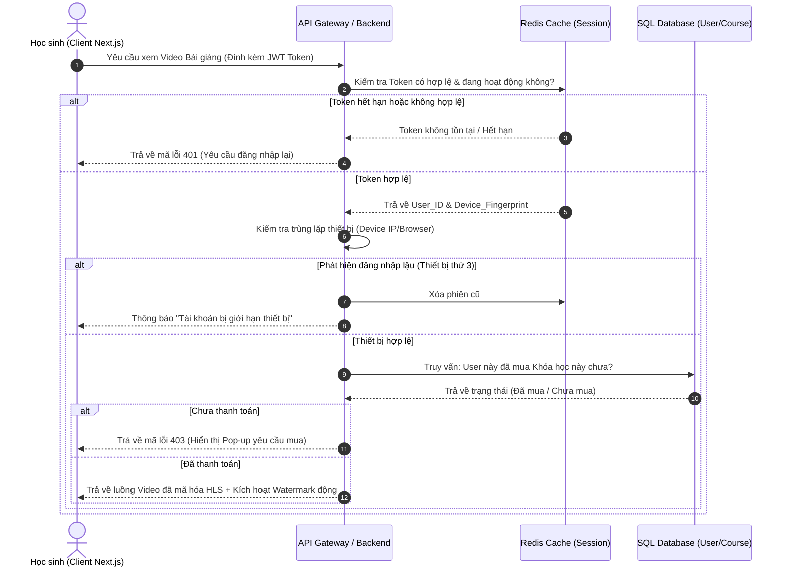

# CHỨC NĂNG 1: ĐỊNH DANH, XÁC THỰC VÀ PHÂN QUYỀN (AUTH & IAM)

---

## 1. Tổng quan & Vai trò Thương mại

Trong một nền tảng giáo dục trả phí như TSIX Education, Module Auth không đơn thuần là để đăng nhập, mà đóng vai trò:

- **Bảo vệ doanh thu:** Ngăn chặn tình trạng "góp gạo thổi cơm chung" — một người mua khóa học rồi chia sẻ tài khoản cho cả nhóm cùng học.
- **Thu thập Lead dữ liệu sạch:** Đảm bảo số điện thoại, email của học sinh lớp 12 chính xác để phục vụ các chiến dịch Remarketing, tư vấn lộ trình ôn thi ĐGNL qua Zalo/SMS.

---

## 2. Chi tiết các Tính năng con (Sub-features)

### A. Đăng ký / Đăng nhập đa phương thức

- **Yêu cầu kỹ thuật:** Hỗ trợ đăng nhập bằng Email/Mật khẩu truyền thống và đăng nhập nhanh 1-click qua **Google** (tài khoản Gmail trường học hoặc cá nhân) và **Facebook**.
- **Luồng xử lý:** Dùng **NextAuth.js** (hoặc Auth0/Firebase Auth) ở Frontend để xử lý Token, sau đó chuyển JWT về Backend (Spring Boot/FastAPI) để xác thực và lưu phiên.

### B. Giới hạn Thiết bị và Quản lý Phiên (Session Control)

**Cơ chế chống chia sẻ tài khoản:**

- Khi tài khoản đăng nhập trên **Thiết bị B**, hệ thống kiểm tra số lượng phiên hoạt động trong RAM Cache (**Redis**).
- Nếu vượt giới hạn (tối đa 1 trình duyệt máy tính + 1 ứng dụng điện thoại), hệ thống sẽ tự động đăng xuất (Kick-out) phiên cũ nhất ở **Thiết bị A**, hoặc hiển thị cảnh báo:
  > *"Tài khoản của bạn đang đăng nhập ở một nơi khác. Vui lòng đăng xuất trước."*

**Browser Fingerprint:** Ghi nhận IP địa lý và dấu vân tay trình duyệt để phát hiện tài khoản có hành vi bất thường (đăng nhập ở 3 tỉnh thành khác nhau trong cùng một ngày).

### C. Phân quyền theo Vai trò (RBAC — Role-Based Access Control)

Hệ thống chia làm 4 vai trò với quyền hạn tăng dần:

| Vai trò | Quyền hạn |
|---|---|
| **Guest** (Khách vãng lai) | Xem trang chủ, tra cứu điểm chuẩn, làm thử 1–2 câu hỏi ĐGNL demo |
| **Student** (Học viên trả phí) | Xem video đã mua, tham gia thi thử, tải PDF, đặt câu hỏi cho AI/Mentor |
| **Mentor** (Giáo viên / Trợ giảng) | Vào CMS đăng bài giảng, phê duyệt câu hỏi thảo luận, chấm điểm bài tự luận |
| **Super Admin** (Chủ sở hữu TSIX) | Toàn quyền hệ thống: báo cáo tài chính, cấu hình cổng thanh toán, chặn/mở khóa tài khoản, backup database |

---

## 3. Sơ đồ Luồng Dữ liệu Chi tiết

Luồng xử lý kiểm tra quyền truy cập khi học sinh bấm xem Video bài giảng Toán lớp 12 trả phí:

---

## 4. Tính Liên kết với các Phân hệ khác

Module Auth & IAM đóng vai trò "màng lọc" và cấp thông tin đầu vào cho toàn bộ các module phía sau:

- **→ LMS Core:** Trả về `User_ID` để ghi nhận tiến độ học (ví dụ: học sinh A đã xem 45% video bài 1 môn Vật lý).
- **→ Exam Engine (Azota):** Khi học sinh nộp bài thi, lấy `User_ID` từ phiên đăng nhập để map với bảng điểm và đẩy lên Bảng xếp hạng, tránh nộp bài hộ người khác.
- **→ Thương mại:** Khi phát sinh giao dịch thành công, Module Thanh toán tìm chính xác `User_ID` để gán quyền sở hữu khóa học (`User_Has_Course`) vào CSDL.
