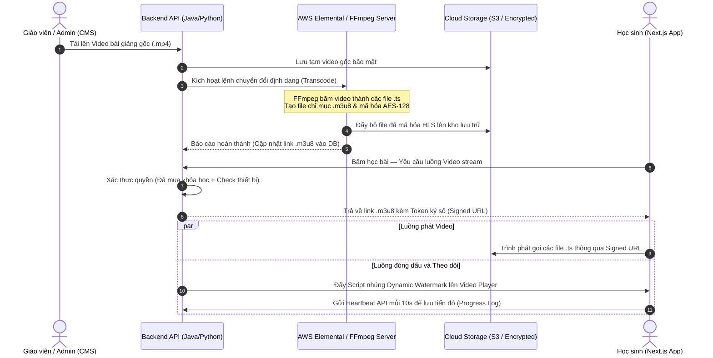

# CHỨC NĂNG 2: PHÂN HỆ QUẢN LÝ NỘI DUNG HỌC TẬP (LMS CORE)

---

## 1. Tổng quan & Vai trò Thương mại

LMS Core giải quyết 3 bài toán kinh doanh lớn:

- **Bảo vệ tài sản tối đa:** Ngăn chặn tuyệt đối việc học sinh dùng IDM, Cốc Cốc hoặc extension để tải lậu video bài giảng 8 môn lớp 12 và video giải đề ĐGNL.
- **Tối ưu hóa trải nghiệm học tập:** Ghi nhận chính xác tiến độ học để học sinh có thể "học tiếp" bất cứ lúc nào trên điện thoại hay máy tính.
- **Tạo phễu Up-sell (Bán thêm):** Hiển thị đan xen các bài học thử (Free Trial) để kích thích học sinh vãng lai quyết định xuống tiền mua trọn gói lộ trình.

---

## 2. Chi tiết các Tính năng con (Sub-features)

### A. Quản lý Cấu trúc Khóa học linh hoạt (Course Hierarchy)

Hệ thống quản lý nội dung theo cấu trúc cây **4 cấp**:

```
Khóa học → Chương/Chuyên đề → Bài học → Tài nguyên (Video / PDF / Quiz tự luyện)
```

**Tính năng phụ:** Admin có thể cấu hình bài học theo 2 chế độ:
- **"Học cuốn chiếu":** Học sinh phải xem hết video hoặc hoàn thành bài test bài 1 mới được mở khóa bài 2.
- **"Học tự do":** Học sinh truy cập tự do tất cả bài học trong lộ trình.

### B. Trình phát Video Bảo mật cao (Secure Video Player)

**Cơ chế truyền tải (HLS Streaming):**

Video gốc được hệ thống tự động băm nhỏ thành các phân đoạn 2–5 giây và mã hóa theo chuẩn **HLS** với định dạng file `.m3u8` và `.ts`. Trình phát video (Video.js hoặc Shaka Player) liên tục yêu cầu các file nhỏ này kèm một **Short-lived Token** xác thực.

**Watermark Động (Dynamic Watermark):**

Một thẻ Text (ví dụ: `TSIX - thonv04@gmail.com - IP: 113.23.xx.xx`) chạy ẩn hiện, thay đổi vị trí liên tục sau mỗi 10–15 giây. Nếu học sinh quay lén màn hình và phát tán, hệ thống lập tức định danh tài khoản vi phạm để khóa vĩnh viễn.

### C. Theo dõi Tiến độ Học tập (Learning Progress Tracking)

- **Cơ chế Heartbeat:** Cứ mỗi 10 giây xem video, Frontend gửi một tín hiệu ngầm lên Backend để cập nhật `current_time`.
- **Đánh dấu hoàn thành:** Khi thời lượng xem đạt ≥ 90%, bài học được tích xanh "Hoàn thành". Hệ thống tự động tính tổng % tiến độ toàn khóa hiển thị dạng **Progress Bar**.

---

## 3. Sơ đồ Luồng Dữ liệu Chi tiết

Luồng từ khi Giáo viên tải video mới lên đến khi phân phối tới màn hình Học viên:



---

## 4. Tính Liên kết với các Phân hệ khác

LMS Core là "trung tâm tiêu thụ giá trị", liên kết mật thiết với toàn bộ hệ thống:

- **→ Auth & IAM:** Nhận thông tin vai trò (Role) và định danh cá nhân (Email/ID) để in Watermark động và kiểm tra quyền thiết bị.
- **→ Thương mại (E-commerce):** LMS cung cấp trạng thái "Học thử" (Free Trial) để kích thích mua. Ngược lại, khi Thương mại báo thanh toán thành công, LMS lập tức gỡ bỏ trạng thái khóa của toàn bộ lộ trình.
- **→ Exam Engine (Azota):** Cuối mỗi chương học, LMS nhúng link "Bài kiểm tra kết thúc chương". Điểm số gửi ngược lại LMS để quyết định học sinh có đủ điều kiện học tiếp chương sau (nếu bật chế độ cuốn chiếu).
- **→ Community & AI Support:** Ngay dưới mỗi video bài giảng có Widget Bình luận. Dữ liệu ngữ cảnh (bài học nào, môn nào, phút bao nhiêu) được truyền sang Trợ lý AI và Mentor để hỗ trợ chính xác.
