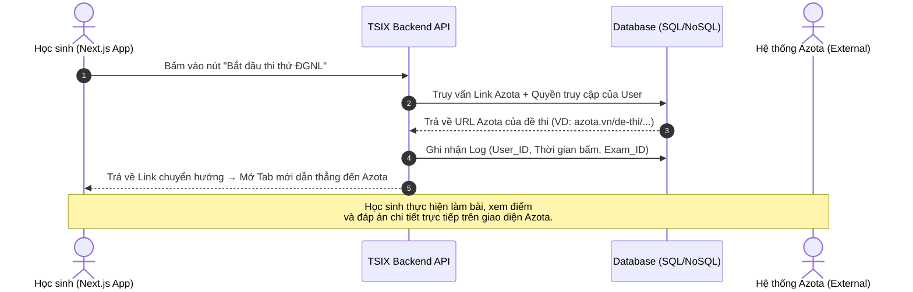

# CHỨC NĂNG 3: PHÂN HỆ THI THỬ QUA LIÊN KẾT AZOTA

---

## 1. Tổng quan & Vai trò Thương mại

Thay vì xây dựng toàn bộ mã nguồn chấm điểm, TSIX Education đóng vai trò là **Nền tảng điều hướng và Quản lý Lộ trình**. Giáo viên chỉ cần tạo đề thi trên Azota, lấy link và cấu hình vào hệ thống TSIX.

**Lợi ích chiến lược:**

- Giúp sản phẩm **ra mắt thị trường (Go-to-market) nhanh hơn gấp 3 lần** so với tự xây Exam Engine.
- Học sinh vẫn có trải nghiệm thi cử chuyên nghiệp từ Azota nhưng luồng đi và về vẫn nằm trong phễu kiểm soát của TSIX.

---

## 2. Chi tiết các Tính năng con (Sub-features)

### A. Quản lý Danh sách và Nhúng Link Đề thi (Exam Link Management)

**Phía Admin (CMS):**

1. Giáo viên tạo đề thi trên trang quản trị Azota (thiết lập thời gian, mật khẩu đề nếu có).
2. Tại Dashboard của TSIX, Admin dán URL đề thi Azota vào bài học/kỳ thi tương ứng.

**Phía Học viên (UI):**

Thay vì hiển thị giao diện làm bài phức tạp, hệ thống hiển thị một nút bấm nổi bật:

> **[Bắt đầu làm bài trên Azota]**

### B. Cơ chế Chuyển hướng Bảo mật (Secure Redirection & Tracking)

Để kiểm soát học sinh nào đã làm bài (phục vụ mục đích thương mại/chăm sóc khách hàng), TSIX không dùng link trần của Azota mà sử dụng một **Link chuyển hướng nội bộ (Redirect Bridge)**.

**Cách hoạt động:**

1. Học sinh bấm nút làm bài.
2. Hệ thống ghi nhận log: `User_A bắt đầu bấm vào đề thi HSA_01 lúc 20:00`.
3. Hệ thống tự động mở Tab mới dẫn đến link Azota của đề thi đó.

---

## 3. Sơ đồ Luồng Dữ liệu Tinh gọn

---

## 4. Tính Liên kết với các Phân hệ khác

### Liên kết kỹ thuật

- **→ Auth & IAM:** Chỉ học sinh đã đăng nhập và xác thực tài khoản hợp lệ mới nhìn thấy và bấm được Link chuyển hướng sang Azota — ngăn chặn việc copy link Azota gửi ra ngoài cho người chưa mua khóa học.
- **→ LMS Core:** Nút làm bài thi Azota được đặt ngay cuối mỗi chương học của lộ trình 8 môn hoặc lộ trình ĐGNL. Học sinh học xong video lý thuyết thì bấm nút này để chuyển sang Azota làm bài tập áp dụng.

### Vận hành thực tế (Thủ công một phần)

Vì không kết nối API kết quả từ Azota về (để tiết kiệm chi phí), cuối mỗi tuần hoặc mỗi kỳ thi thử, Giáo viên/Admin sẽ:

1. Xuất file Excel điểm số từ Azota.
2. Đăng **Bảng vinh danh** (Top thí sinh điểm cao) lên Phân hệ Cộng đồng/Trang chủ của TSIX để tạo không khí thi đua.
