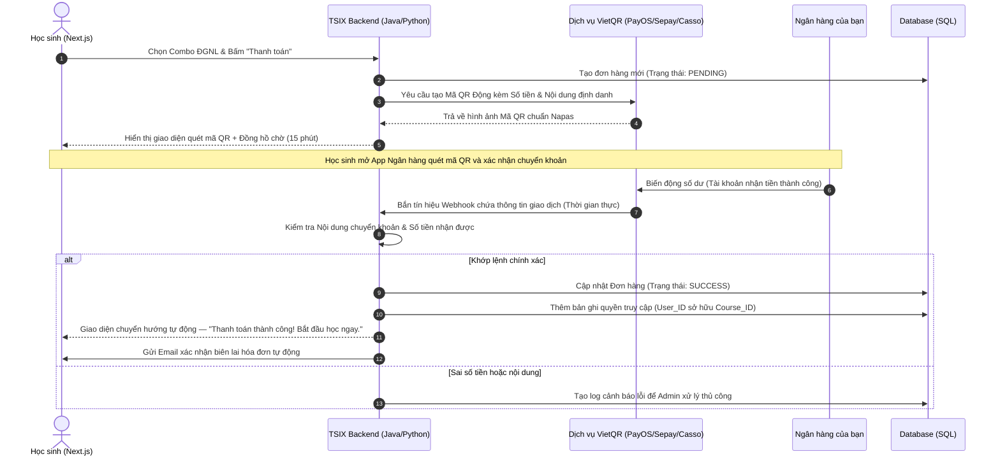

# CHỨC NĂNG 4: PHÂN HỆ THƯƠNG MẠI VÀ BÁN HÀNG TỰ ĐỘNG (E-COMMERCE & FUNNEL)

---

## 1. Tổng quan & Vai trò Thương mại

Module này quyết định tỷ lệ chuyển đổi từ học sinh xem thử → học sinh trả phí:

- **Tự động hóa hoàn toàn (Zero-Touch):** Học sinh lớp 12 thường mua khóa học rất muộn (11–12 giờ đêm). Hệ thống giao dịch tự động hoạt động **24/7** giúp không bỏ lỡ bất kỳ nguồn thu nào.
- **Tạo động lực mua hàng (Urgency & Scarcity):** Quản lý các chiến dịch Flash Sale, đếm ngược giảm giá, mã Coupon kích thích học sinh xuống tiền nhanh hơn.

---

## 2. Chi tiết các Tính năng con (Sub-features)

### A. Quản lý Giỏ hàng và Cấu hình Gói học (Course Pricing & Cart)

**Thiết lập gói linh hoạt:**

| Loại gói | Ví dụ | Mức giá |
|---|---|---|
| Bán lẻ từng môn | Khóa Toán 12 | ~500.000đ |
| Combo Lộ trình | Combo 8 môn thi Tốt nghiệp | ~1.500.000đ |
| Combo ĐGNL | Lộ trình luyện thi HSA trọn gói | ~1.500.000đ |

**Trang Checkout tối giản:** Học sinh chỉ cần điền mã giảm giá (nếu có), hệ thống tự tính lại số tiền cuối cùng và chuyển sang trang thanh toán.

### B. Cổng Thanh toán Quét mã QR Tự động (Auto-Payment Gateway)

**Cơ chế QR Dynamic (Mã QR động):**

Khi học sinh bấm "Thanh toán", hệ thống tạo một mã **VietQR động** (chuẩn Napas) dựa trên mã hóa đơn (ví dụ: `TSIX12345`). Mở app ngân hàng quét mã là hệ thống tự điền:

- ✅ Số tài khoản nhận
- ✅ Số tiền chính xác đến từng đồng
- ✅ Nội dung chuyển khoản định danh duy nhất

**Xử lý Webhook tài chính:**

Khi ngân hàng nhận tiền, tín hiệu **Webhook** được gửi ngay từ bên trung gian (Casso, PayOS, Sepay hoặc VNPay/Momo) về Backend TSIX để khớp lệnh.

### C. Hệ thống Tiếp thị liên kết (Affiliate Marketing)

Tạo **Link giới thiệu (Affiliate Link)** cho từng ID tài khoản (của chủ sở hữu hoặc Mentor, KOC cộng tác). Khi học sinh bấm link từ TikTok về web và mua khóa học, hệ thống tự động ghi nhận hoa hồng để đo lường kênh nào đang hiệu quả nhất.

---

## 3. Sơ đồ Luồng Dữ liệu Chi tiết

Luồng từ khi học sinh chọn mua Combo ĐGNL đến khi hệ thống tự động mở khóa học:

---

## 4. Tính Liên kết với các Phân hệ khác

- **→ Auth & IAM:** Sử dụng thông tin người dùng đăng nhập (`User_ID`) để gắn chặt vào hóa đơn và tạo nội dung chuyển khoản định danh (ví dụ: `TSIX 0987654321`).
- **→ LMS Core:** Ngay khi Database cập nhật trạng thái đơn hàng thành `SUCCESS`, LMS lập tức gỡ bỏ biểu tượng "Khóa" ở toàn bộ lộ trình video tương ứng với gói học sinh vừa mua.
- **→ Admin Dashboard:** Đẩy dữ liệu doanh thu, số lượng đơn hàng theo ngày/tháng lên biểu đồ trực quan — nắm bắt tình hình tài chính mà không cần cộng sổ thủ công.
