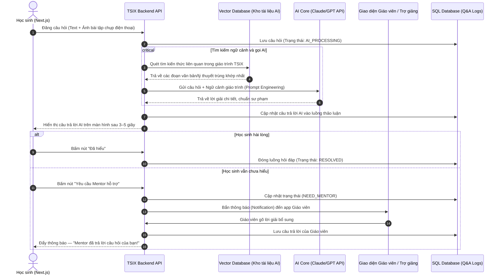

# CHỨC NĂNG 5: PHÂN HỆ TƯƠNG TÁC VÀ HỖ TRỢ THÔNG MINH (COMMUNITY & AI SUPPORT)

---

## 1. Tổng quan & Vai trò Thương mại

- **Nâng cao giá trị sản phẩm:** Một khóa học có AI hỗ trợ giải bài 24/7 và cộng đồng trao đổi sôi nổi sẽ có giá trị thương mại cao hơn hẳn khóa học chỉ có video xem thụ động — có thể định giá gói học cao hơn.
- **Tối ưu chi phí nhân sự:** Trợ lý AI (RAG Agent) tự động xử lý trước khoảng **70% câu hỏi lý thuyết cơ bản** dựa trên kho tài liệu bài giảng của TSIX, giúp tiết kiệm chi phí thuê trợ giảng.

---

## 2. Chi tiết các Tính năng con (Sub-features)

### A. Diễn đàn Hỏi đáp theo Ngữ cảnh Bài học (Contextual Q&A Forum)

- **Vị trí hiển thị:** Widget Hỏi đáp nhúng trực tiếp ngay phía dưới mỗi Video bài giảng lớp 12 hoặc link đề thi Azota.
- **Tính năng phụ:**
  - Học sinh có thể chụp ảnh bài tập bằng điện thoại và tải lên (Upload) trực tiếp.
  - Hỗ trợ **Upvote/Downvote** để các câu hỏi hay hoặc câu trả lời chính xác được đẩy lên đầu.

### B. Trợ lý AI Giải bài Thông minh (RAG AI Assistant)

**Cơ chế hoạt động (RAG — Retrieval-Augmented Generation):**

Khi học sinh đăng câu hỏi, **Trợ lý AI của TSIX** lập tức quét qua cơ sở dữ liệu (các file tài liệu PDF, kịch bản video bài giảng, ngân hàng đề thi đã được vector hóa — **Vector Database**).

**Kết quả trả về:** AI đưa ra câu trả lời gợi ý chi tiết kèm lời nhắn:

> *"Kiến thức này nằm ở phút thứ 15:20 của Video bài giảng phía trên, bạn có thể xem lại nhé!"*

### C. Giao diện Quản lý của Mentor (Mentor Workspace)

Hệ thống lọc tự động theo 2 luồng:

| Trạng thái | Hành động |
|---|---|
| AI đã trả lời xuất sắc, học sinh bấm "Đã hiểu" | Đóng luồng tự động |
| Học sinh bấm "Tôi vẫn chưa hiểu, cần Mentor giải thích thêm" | Đẩy về hàng đợi của Giáo viên/Trợ giảng để can thiệp thủ công |

---

## 3. Sơ đồ Luồng Dữ liệu Chi tiết

Luồng xử lý khi học sinh đăng câu hỏi bài tập Toán hoặc câu hỏi ĐGNL khó:

---

## 4. Tính Liên kết với các Phân hệ khác

- **→ Auth & IAM:** Chỉ tài khoản vai trò **Mentor/Admin** mới có quyền xóa bình luận tiêu cực, duyệt câu hỏi, hoặc đăng câu trả lời gắn nhãn "Giáo viên chính thức". Chỉ **Student** trả phí mới được dùng tính năng hỏi AI.
- **→ LMS Core:** Khi học sinh đăng câu hỏi ở bài giảng nào, hệ thống tự động gắn tag tên khóa học, tên chương vào câu hỏi — giúp AI thu hẹp phạm vi tìm kiếm tài liệu (ví dụ: học sinh đang xem bài Nguyên hàm thì AI chỉ tìm tài liệu trong chương Nguyên hàm).
- **→ Exam Engine (Azota):** Khi học sinh làm đề thi trên Azota xong và có câu giải chi tiết chưa hiểu, có thể copy câu đó sang phân hệ này để AI hoặc học sinh khác hỗ trợ thảo luận nhóm.
